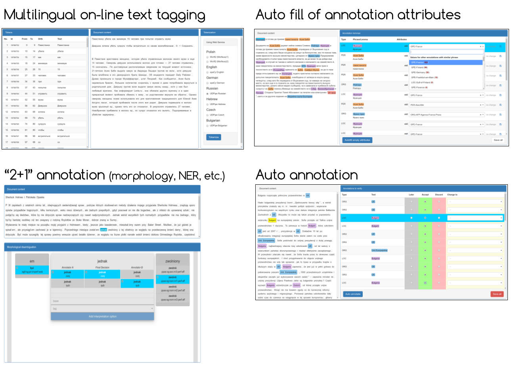

Inforex
=======

[](https://www.gnu.org/licenses/lgpl-3.0)

Copyright (C) Wrocław University of Science and Technology (PWr), 2013-2020. 
All rights reserved.

Developed within [CLARIN-PL](http://clarin-pl.eu/) project.

About
-----

Inforex is a web system for text corpora construction. 
Inforex allows parallel access and sharing resources among many users. 
The system assists semantic annotation of texts on several levels, 
such as marking text references, creating new references, or marking word senses.



Contributors
------------
* Michał Marcińczuk,
* Adam Kaczmarek,
* Jan Kocoń,
* Marcin Ptak,
* Mikołaj Szewczyk,
* Marcin Oleksy,
* Wojciech Rauk.


Citing
------


Marcińczuk, M. & Oleksy, M. (2019). Inforex — a Collaborative Systemfor Text Corpora Annotation and Analysis Goes Open. In Proceedings of the International Conference on Recent Advances in Natural Language Processing, RANLP 2019, pages 711―719. Varna, Bulgaria. INCOMA Ltd.

\[[PDF](https://www.researchgate.net/publication/335402187_Inforex_-_a_Collaborative_System_for_Text_Corpora_Annotation_and_Analysis_Goes_Open)\]

<details><summary>[Bibtex]</summary>
<p>

```
@inproceedings{marcinczuk-oleksy-2019-inforex,
    title     = "{I}nforex {---} a Collaborative Systemfor Text Corpora Annotation and Analysis Goes Open",
    author    = "Marci{\'n}czuk, Micha{\l}  and
                Oleksy, Marcin",
    booktitle = "Proceedings of the International Conference on Recent Advances in Natural Language Processing (RANLP 2019)",
    month     = sep,
    year      = "2019",
    address   = "Varna, Bulgaria",
    publisher = "INCOMA Ltd.",
    url       = "https://www.aclweb.org/anthology/R19-1083",
    doi       = "10.26615/978-954-452-056-4_083",
    pages     = "711--719",
}
```   
</p>
</details>

Installation and setup
======================

Dev-mode using Docker
---------------------

The dependencies are installed within Docker container 
and the Inforex source code is linked to the container as an external storage. 

Before building the docker install *Composer*, *Docker* and *Docker Compose* running the following command:

```bash
sudo apt-get install composer docker docker-compose
```
Than build the docker by executing the following script. 

```bash
./docker-dev-up.sh
```

Links:
* http://localhost:9080/inforex — default admin account admin/admin,
* http://localhost:7080 — phpMyAdmin with default an account inforex/password.   

When new source files are added it is required to reload the composer dependencies 
by executing the following command:

```bash
composer update
```

Local installation without Docker
---------------------------------

See [INSTALL.md](INSTALL.md).


Latest updates
---------------------------------
* Speeding up docker rebuild by using multi-stage build ([PR#99](https://github.com/CLARIN-PL/Inforex/pull/99))
* Corpus exporter to CONLL and JSON format ([PR#94](https://github.com/CLARIN-PL/Inforex/pull/94))
* Import documents from a zip file as a background process ([PR#93](https://github.com/CLARIN-PL/Inforex/pull/93))
* Batch document deletion ([PR#92](https://github.com/CLARIN-PL/Inforex/pull/92))
* Custom corpus css styles ([PR#91](https://github.com/CLARIN-PL/Inforex/pull/91))
* UI improvements([PR#88](https://github.com/CLARIN-PL/Inforex/pull/88), 
[PR#84](https://github.com/CLARIN-PL/Inforex/pull/84),
[PR#82](https://github.com/CLARIN-PL/Inforex/pull/82))
* Export raw text content ([PR#83](https://github.com/CLARIN-PL/Inforex/pull/83)).