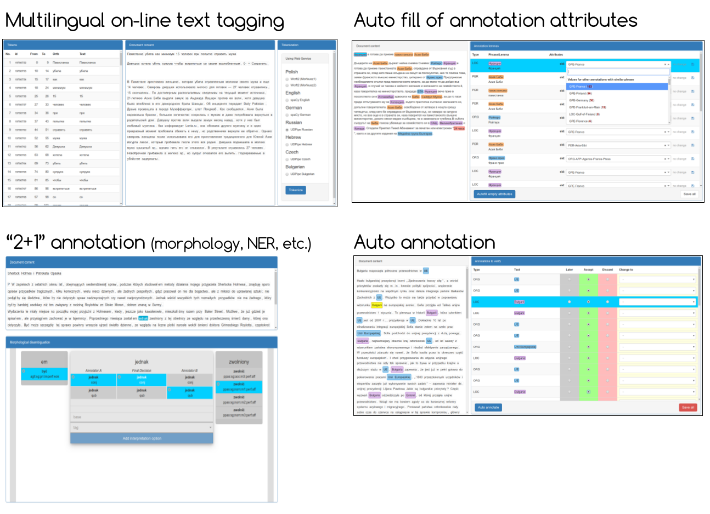

Inforex
=======

[](https://www.gnu.org/licenses/lgpl-3.0)

Copyright (C) Wrocław University of Science and Technology (PWr), 2013-2026.
Released under the GNU Lesser General Public License v3.0 or later (LGPL-3.0-or-later).

Developed within [CLARIN-PL](http://clarin-pl.eu/) project.

Current lead maintainer: **Tomasz Naskręt**.
Current product owner:  **Marcin Oleksy**.

About
-----

Inforex is a web-based system for building, curating, annotating, and analyzing text corpora.
It supports collaborative work by many users at the same time, with shared access to documents,
annotation schemas, corpora resources, and administrative tools.

The platform supports a broad range of corpus-management and annotation workflows, including:

* corpus creation and multi-user corpus sharing,
* document import from plain files, ZIP packages, and background import pipelines,
* manual annotation on multiple layers, including semantic, lexical, and relation-based annotation,
* agreement-oriented annotation modes for parallel annotator work,
* 2+1 annotation workflows, where two annotators work independently and a third person resolves disagreements,
* relation annotation between spans and entities,
* frame, WSD, and schema-driven annotation support,
* configurable annotation and relation schemas managed from the administration panel,
* local user, role, and permission management together with federated authentication,
* background task queues for import, export, processing, and report generation,
* multiple export formats, including XML, text, CoNLL-U, JSON, and Parquet-based formats,
* corpus report generation workflows integrated with Korpuskop,
* administration views for user activity monitoring and queue monitoring,
* document-level browsing, filtering, and preview perspectives for annotation and analysis.



Contributors
------------
* Michał Marcińczuk,
* Adam Kaczmarek,
* Jan Kocoń,
* Marcin Ptak,
* Mikołaj Szewczyk,
* Wojciech Rauk.


Citing
------
Marcińczuk, M. & Oleksy, M. (2019). Inforex — a Collaborative Systemfor Text Corpora Annotation and Analysis Goes Open. In Proceedings of the International Conference on Recent Advances in Natural Language Processing, RANLP 2019, pages 711―719. Varna, Bulgaria. INCOMA Ltd.

\[[PDF](https://www.researchgate.net/publication/335402187_Inforex_-_a_Collaborative_System_for_Text_Corpora_Annotation_and_Analysis_Goes_Open)\]

<details><summary>[Bibtex]</summary>
<p>

```
@inproceedings{marcinczuk-oleksy-2019-inforex,
    title     = "{I}nforex {---} a Collaborative Systemfor Text Corpora Annotation and Analysis Goes Open",
    author    = "Marci{\'n}czuk, Micha{\l}  and
                Oleksy, Marcin",
    booktitle = "Proceedings of the International Conference on Recent Advances in Natural Language Processing (RANLP 2019)",
    month     = sep,
    year      = "2019",
    address   = "Varna, Bulgaria",
    publisher = "INCOMA Ltd.",
    url       = "https://www.aclweb.org/anthology/R19-1083",
    doi       = "10.26615/978-954-452-056-4_083",
    pages     = "711--719",
}
```   
</p>
</details>

Installation and setup
======================

Recommended development setup: Docker
-------------------------------------

The recommended way to run Inforex is the Docker-based development environment.
Application dependencies are installed inside containers, while the repository
is mounted into the web container during development.

Docker Compose variants used in this repository:

* `docker-compose.yml` — development setup, including local development mounts and optional services such as Keycloak and phpMyAdmin,
* `docker-compose.prod.yml` — production-oriented setup, without Keycloak and phpMyAdmin, with the application code baked into the web image and persistent MySQL data stored in a Docker volume.

### 1. Install prerequisites

Install Docker, Docker Compose, and Composer:

```bash
sudo apt-get install composer docker docker-compose
```

### 2. Build and start the environment

Run the development bootstrap script:

```bash
./docker-dev-up.sh
```

If you need to rebuild selected services later, use standard Docker Compose commands,
for example:

```bash
docker compose build www korpuskop-worker
docker compose up -d db keycloak korpuskop-worker www haproxy
```

### 3. Apply database migrations

Schema changes for existing databases are defined in `database/inforex-v1.0-changelog.sql`
and applied through Liquibase:

```bash
docker compose run --rm liquibase
```

Database bootstrap notes:

* Docker does not mount `database/inforex-v1.0.sql` directly into MySQL startup.
* Initial schema bootstrap is handled by `database/init/001-bootstrap-inforex.sh`.
* Fresh environments use the bootstrap SQL; existing environments should be updated with Liquibase.

### 4. Open the local services

After startup, the local services are available at:

* `http://localhost:9080/inforex` — Inforex application (`admin` / `admin`)
* `http://localhost:7080` — phpMyAdmin (`inforex` / `password`)
* `http://localhost:9081` — local Keycloak admin console (`admin` / `admin`)

### 5. Keycloak / OIDC test configuration

The local test setup uses:

* realm: `inforex`
* public issuer: `http://localhost:9081/realms/inforex`
* internal Docker issuer base: `http://keycloak:8080`
* client id: `inforex-local`
* client secret: `inforex-secret`
* redirect URI: `http://localhost:9080/inforex/index.php?page=oidc_callback`
* test user: `demo` / `demo123`

On first login through Keycloak, Inforex asks whether the user wants to:

* link the federated account to an existing local account using the old local password, or
* create a new local Inforex profile while keeping roles and permissions stored locally.

If Keycloak does not start and reports `Provided hostname is neither a plain hostname nor a valid URL`,
verify that `KC_HOSTNAME` includes the scheme, for example `http://localhost:9081`.

### 6. Corpus report / Korpuskop setup

The report workflow uses a dedicated `korpuskop-worker` container with a newer runtime:

* report generation is available from `Advanced options -> Generate corpus report`
* access to corpus reports requires the `report_generation` role
* document reports use `docker/www/korpuskop-runtime/config/document.report.json`
* dialog reports use `docker/www/korpuskop-runtime/config/dialog.report.json`
* `CLARIN_OAPI_KEY` is passed to the report runtime from `Config::Cfg()->put_lpmn_api_key(...)`

### 7. Administration views

The administration panel includes operational and configuration views that help manage
users, schemas, system activity, and background processing.

The most important administration views are:

* `Activity dashboard`
  * shows users who are active right now,
  * provides a quick view of recent activity intensity,
  * helps administrators confirm whether the system is currently in use.

* `Queue monitor`
  * shows all major background queues in one place,
  * displays waiting, processing, error, completed, and canceled items,
  * supports drill-down into concrete queue items,
  * allows selected status-management actions for tasks and exports.

* `Users`
  * manages local user accounts,
  * assigns system roles,
  * supports corpus-level access management together with the corpus settings views.

* `Annotation schema`
  * manages annotation sets, subsets, and types,
  * defines the structure used by annotators during corpus work.

* `Annotation shared attributes`
  * manages shared attribute definitions and reusable controlled values,
  * helps keep annotation metadata consistent across annotators and corpora.

* `Relation schema`
  * manages relation sets and relation types,
  * defines which relation structures are available in annotation and reporting views.

* `Frame schema`
  * manages frame-oriented schema elements used by frame annotation workflows.

* `WSD schema`
  * manages resources used by word sense disambiguation workflows.

* Diagnostic and activity views
  * include registered and anonymous user activity reports,
  * include AJAX, page-access, and database diagnostics for troubleshooting and monitoring.

### 8. Updating dependencies after source changes

If you add new PHP dependencies, refresh Composer inside the project:

```bash
composer update
```

### 9. Database maintenance

Production-oriented SQL maintenance helpers are available in:

* `database/maintenance/`

The current maintenance notes cover:

* large-table analysis,
* pruning old rows from `activities`,
* removing the legacy `tokens_backup` table after backup.

Detailed instructions are available in:

* `documentations/maintenance/database-size-optimization.md`


Latest updates
---------------------------------
* Keycloak-only authentication with local users, roles, and permissions kept in Inforex
* New corpus report workflow with Korpuskop integration and dedicated `korpuskop-worker`
* New export variants: `CCL XML`, `Text format`, `CoNLL-U CLARIN`, standard `CoNLL-U`, `CLARIN JSON`, `CLARIN Parquet ZST`, and `Dialog parquet`
* New administration panels: `Activity dashboard` and `Queue monitor`
* Queue monitor drill-down, status editing, and `canceled` status support for tasks, exports, and reports
